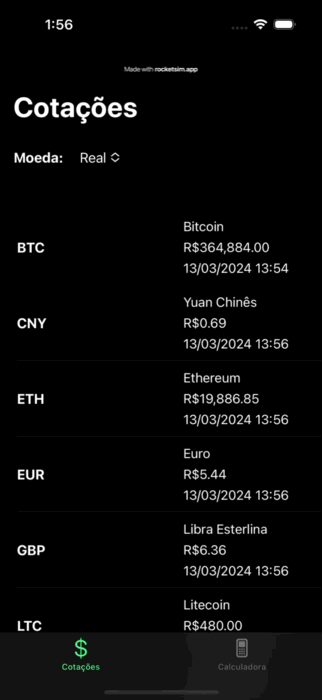

Currency Tracker
==========
Currency Tracker is an app designed to provide users with the ability to view and convert currency exchange rates.

### Technologies and libraries
The project was developed using Swift, SwiftUI, Core Data, Unit Tests.

## Getting Started

You are able to run the project using a Macbook and XCode 14.3.1.

The project has two targets: **CurrencyTrackerCore** and **CurrencyTrackerApp**. To run the app, ensure that you have selected the **CurrencyTrackerApp** target.

> [!WARNING]
> Different XCode versions may work but you run the risk of getting some issues.

## Running the tests

The project includes unit tests for its core features. You can run them by selecting the **CurrencyTrackerCore** target and pressing ⌘ + U.

The CurrencyTrackerCore was developed as a macOS framework to enable faster test execution. To utilize it, you can select a Mac instead of an iPhone simulator.

## App Architecture

