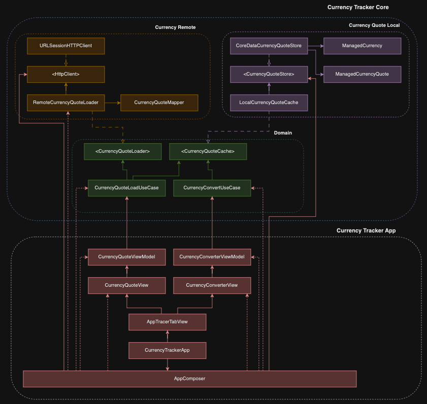

Currency Tracker
==========
Currency Tracker is an app designed to provide users with the ability to view and convert currency exchange rates.

### Technologies and libraries
The project was developed using Swift, SwiftUI, Core Data, Unit Tests.

## Getting Started

You are able to run the project using a Macbook and XCode 14.3.1.
> [!WARNING]
> Different XCode versions may work but you run the risk of getting some issues.

## App Architecture

